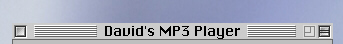



## Mac Titlebar Control V1\.2

### Description

The Code is an update that uses properties instead of methods to update,it also uses an align property so no code is needed to resize it when the form is resized.

Questions, Comments?

Email me: daveismith@hotmail.com
 
### More Info
 

             |
---                |---
**Submitted On**   |2001-06-25 15:37:54
**By**             |[David Smith](https://github.com/Planet-Source-Code/PSCIndex/blob/master/ByAuthor/david-smith.md)
**Level**          |Intermediate
**User Rating**    |4.9 (34 globes from 7 users)
**Compatibility**  |VB 6\.0
**Category**       |[Custom Controls/ Forms/  Menus](https://github.com/Planet-Source-Code/PSCIndex/blob/master/ByCategory/custom-controls-forms-menus__1-4.md)
**World**          |[Visual Basic](https://github.com/Planet-Source-Code/PSCIndex/blob/master/ByWorld/visual-basic.md)
**Archive File**   |[Mac Titleb2167962520\.zip](https://github.com/Planet-Source-Code/david-smith-mac-titlebar-control-v1-2__1-24424/archive/master.zip)

